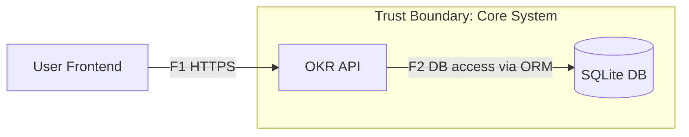
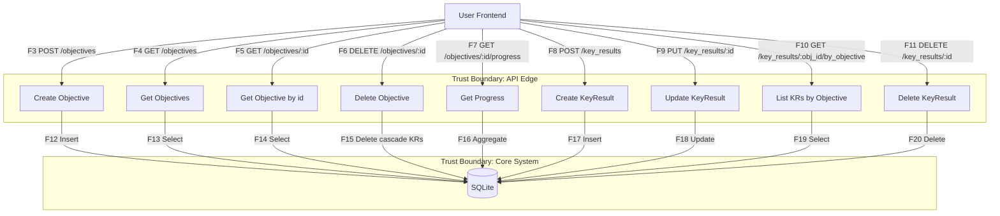
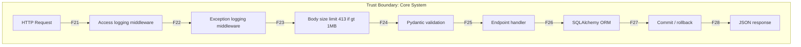

# Data Flow Diagram (DFD) — OKR Tracker (FastAPI)

## Level 0 — Context Diagram

## Level 1 — Logical Data Flow (Endpoints & Services)

## Level 2 — Internal Processes (Middleware -> Validation -> ORM -> Logging)

## Trust Boundaries
- TB1: HTTP boundary — User <-> API
- TB2: DB boundary — API <-> SQLite
- TB3: Middleware boundary — Request <-> Validation/Logging/Body Limit
